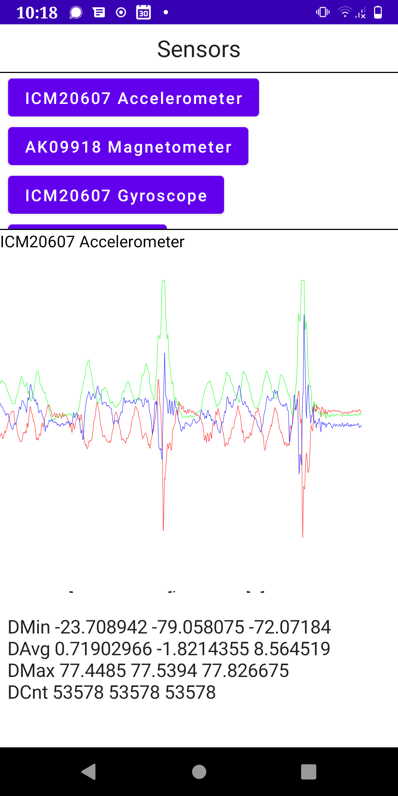
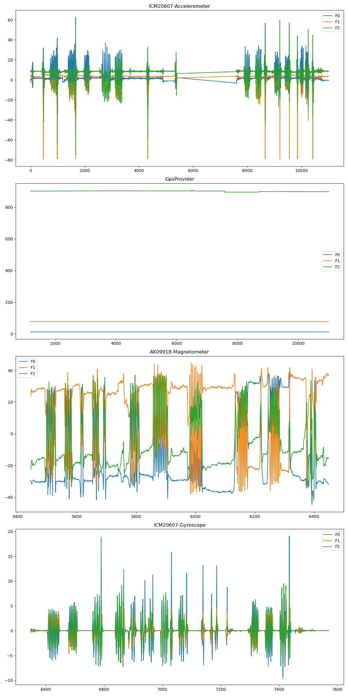

###########
SensorsK
###########

Author: HanishKVC, 2022

Version: v20230105IST1846

License: GPL3+

Overview
##########

Allows one to get the list of sensors in a android device and inturn select
one of them for monitoring live in GUI, as well as log into a csv file for
later analysis.

Parallely the GPS location info is also saved into the csv file.

Android app color codes upto 3 parameters wrt any given sensor with R, G, B.
However if there are more than 3 parameters being monitored/provided by a
sensor, then it will plot the remaining parameters with black color.

One can switch between sensors if required. At any given time, currently,
only one sensor can be selected. The csv file will contain sensor data wrt
all the sensors selected, for the duration for which they were selected
respectively.

There is also a python helper script to plot the captured sensor data. If
the user had switched sensors in a given run of the android app, then the
csv file would have data about multiple sensors, the logic will plot data
wrt each sensor seperately. It also prints some useful summary wrt data in
the console. A image is captured wrt data plot under /tmp/pyplotdata.png

Misc: A long time back, I vaguely remember there being a google's android app
for monitoring sensors in a android device or so, however now I am not able to
find/recall the same, so created this, for some experimentation I was doing.

Images
=======

App (Android version) Usage
#############################

Allows one to get the list of sensors in a android device and inturn select
one of them for monitoring live in GUI, as well as log into a csv file for
later analysis. Parallely GPS location info is also saved into the csv file.

The android program is currently programmed to work in potrait mode. Ideally
the program should always remain in potrait mode. However for some reason,
if it keeps changing orientation on your device, remember to disable auto
screen rotation on your device settings.

NOTE: One can look at the selected sensor's details including data related
details like min, max, avg, time delta and also how many samples have been
captured, in the sensor data section in the bottom 1/3rd of the screen, by
scrolling in this sensor and its data summary details area.

ALERT: Currently the program is written to be a forground activity with a
live view/plot of the sensor being monitored.

Sampling Rate
==============

The program by default hints Android to capture the sensor data at a low
sampling rate, to help with power consumption as well as to help with keeping
the amount of data captured by default to be a minimum. However when device
moment is detected, android may, based on kind of movement, switch to a high
sampling rate for some inbetween periods.

The time related status line as part of the sensor summary text data,
indicates the relative time delta between sensor events, in the order of
min, avg and max in terms of milliseconds.

Plot
======

Each captured sensor data event corresponds to one entry along the x-axis.
By default the available data set is auto scaled/expanded along the x-axis,
if the number of data records is less than the number of pixels on the screen
along xaxis.

Y-axis plots the sensed value wrt all the parameters captured by the sensor.
The y-axis is autoscaled based on the min and max value seen in the captured
data across all the fields/parameters.

The logic uses the withTransform to apply scaling and translation wrt all
points of data in a transparent and straight forward way.

CSV file
==========

THe logic by default saves/logs sensor data into csv file, at a granularity
of 1000+ records. The saving to csv is triggered in the background as a
parallel activity, which runs once every 10+ seconds or so.

So normally captured data gets saved into csv only at periodic intervals,
provided there is sufficient amount of data. So one needs to wait for 1000+
records to be captured wrt a sensor, and inturn the background save logic
to trigger for the same to get written to the csv file.

One can look at the LastSave datetime info shown along with SensorData
summary towards the bottom of the screen to confirm that the captured data
has been saved, ideally before going back (which inturn clears the sensor
selection) or switching to a different sensor. You may have to scroll down
wrt summary text to see the same.

NOTE: One will also see the plot in the screen change, as the background
save to csv logic saves the data and clears the in memory buffer. The save
may complete few seconds after that.

If user switchs sensors or clears the sensor selection, even before program
has captured 1k+ sensor event datas, the program will still try and save
the currently captured set of data.

The CSV file is maintained in the external/emulated storage area alloted
for the android application wrt its files.

GUI Interaction
=================

Double tapping the Plot area toggles between FullScreen and inbetween mode
wrt the plot.

Pressing back button, when a sensor is already selected, will clear the
sensor selection. Pressing back button once again will quit the app.

NOTE: Remember to give few seconds between pressing back button to clear
a sensor selection and pressing back button again to quit the program. So
that program gets a oppurtunity to save the captured data into csv.

When user reselects the same(again)/different sensor, it takes care of
reseting the auto scaling wrt y axis to start afresh.

Python helper script
######################

This plots the captured sensor parameters wrt each sensor, as well as the
deltas wrt the timestamps of the sensor data captures.

It also prints summary info wrt data values of each of the parameter captured
wrt each sensor.

ALERT: The time stamp deltas are clipped to be between the min and median
values found wrt the timestamp deltas.

ALERT: As there could be multiple sensors monitored in a single session, the
plots may not be clearly visible in the pyplot window. However one can look
into the plot saved into /tmp/pyplotdata.png to get a clear picture of data.

Currently as the Android sensor data capture dont support a fixed sampling
rate, and it can switch between low and high sampling rates, a fft of the
captured sample data is not done. NOTE: One can use the timestamp info
stored with each record entry, to get the sample rate wrt adjacent samples,
as well as on average over a given window of data.

