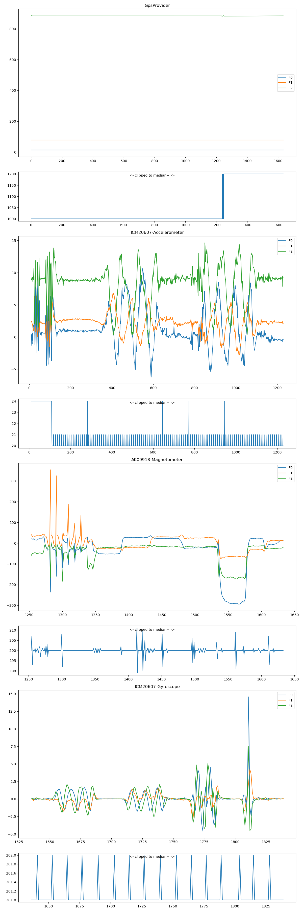

###########
SensorsK
###########

Author: HanishKVC, 2022

Version: v20230103IST1121

License: GPL3+

Overview
##########

Allows one to get the list of sensors in a android device and inturn select
one of them for monitoring live in GUI, as well as log into a csv file for
later analysis.

Parallely the GPS location info is also saved into the csv file.

Android app color codes upto 3 parameters wrt any given sensor with R, G, B.
However if there are more than 3 parameters being monitored/provided by a
sensor, then it will plot the remaining parameters with black color.

There is also a python helper script to plot the captured sensor data. If
the user had switched sensors in a given run of the android app, then the
csv file would have data about multiple sensors, the logic will plot data
wrt each sensor seperately. It also prints some useful summary wrt data in
the console.

Misc: A long time back, I vaguely remember there being a google's android app
for monitoring sensors in a android device or so, however now I am not able to
find/recall the same, so created this, for some experimentation I was doing.

Images
=======

.. image:: data/20230103_Screenshot_SensorK.png
   :alt: A screen capture of the SensorK android app

App (Android version) Usage
#############################

The android program currently doesnt take care of handling device screen
auto rotation wrt gui programs, so disable auto screen rotate in the settings.

Plot
======

Each captured sensor data event corresponds to one entry along the x-axis.
By default the available data set is auto scaled/expanded along the x-axis,
if the number of data records is less than the number of pixels on the screen
along xaxis.

Y-axis plots the sensed value wrt all the parameters captured by the sensor.
The y-axis is autoscaled based on the min and max value seen in the captured
data across all the fields/parameters.

The logic uses the withTransform to apply scaling and translation wrt all
points of data in a transparent and straight forward way.

CSV file
==========

THe logic by default saves/logs sensor data into csv file, at a granularity
of once every 1000 records have been captured. So for now remember to capture
atleast 1000 records wrt any sensor, before switching them, if you want to
save the corresponding sensor data into csv file.

The CSV file is maintained in the external/emulated storage area alloted
for the android application wrt its files.

GUI Interaction
=================

Double tapping the Plot area toggles between FullScreen and inbetween mode
wrt the plot.

Pressing back button, when a sensor is already selected, will clear the
sensor selection. Pressing back button once again will quit the app.

When user reselects the same(again)/different sensor, it takes care of reseting
the auto scaling wrt y axis to start afresh.

